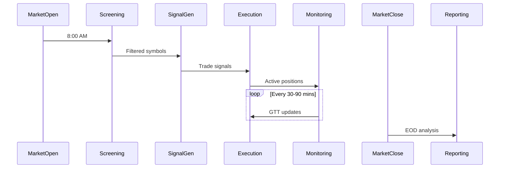
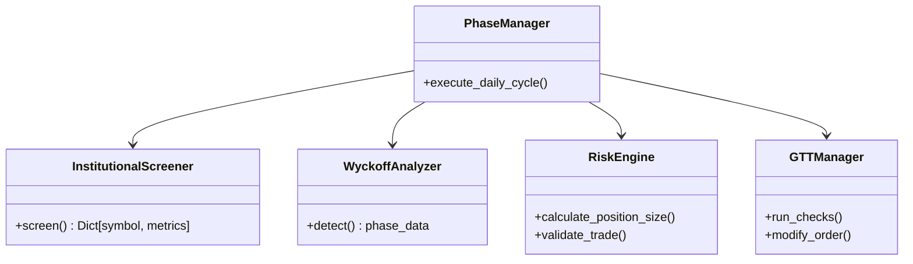
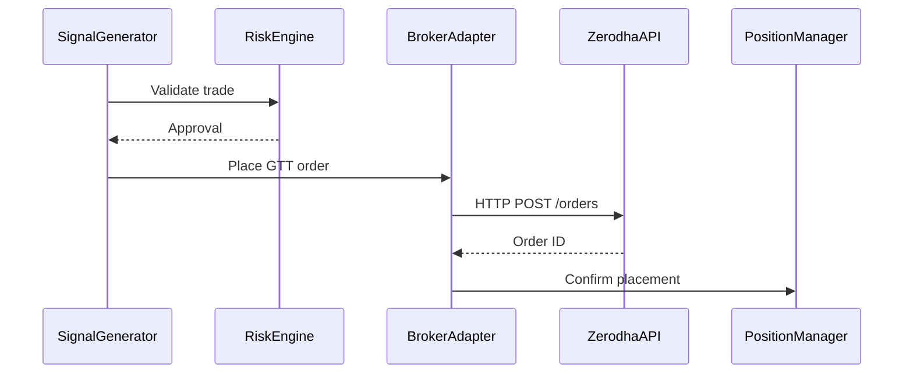

Here's comprehensive **High-Level Design (HLD)** and **Low-Level Design (LLD)** documentation for your Swing Trading System:

---

# **Swing Trading System - Technical Design**

## **1. High-Level Design (HLD)**

### **1.1 System Architecture**

  
_(Visual representation of components and data flow)_

**Key Components:**

1. **Data Ingestion Layer**

   - Market data feeds (NSE/BSE)
   - Institutional flow APIs
   - News aggregators

2. **Core Engine**

   - Phase-based workflow manager
   - Signal generation pipeline
   - Risk management subsystem

3. **Execution Layer**

   - Broker integrations (Zerodha/Upstox)
   - Order management system
   - GTT order processor

4. **Monitoring & Alerts**

   - Real-time position tracker
   - Alert dispatcher (Telegram/Email)

5. **Backtesting Framework**
   - Walkforward tester
   - Monte Carlo simulator

### **1.2 Workflow**



### **1.3 Key Technical Decisions**

| Decision Point  | Approach                 | Rationale                         |
| --------------- | ------------------------ | --------------------------------- |
| Data Pipeline   | Pandas + Custom Caching  | Balance flexibility & performance |
| Order Execution | Broker-specific adapters | Handle API differences            |
| Backtesting     | Vectorized operations    | Faster historical testing         |
| Alerting        | Telegram-first design    | Real-time mobile access           |

---

## **2. Low-Level Design (LLD)**

### **2.1 Core Class Diagram**



### **2.2 Key Modules Specification**

#### **2.2.1 Morning Screening**

```python
class InstitutionalScreener:
    """Filters stocks based on institutional activity"""

    def screen(self) -> Dict:
        """
        Output: {
            'RELIANCE': {
                'fii_net': 3.2e7,
                'dii_net': 1.8e7,
                'delivery_pct': 42
            }
        }
        """
```

#### **2.2.2 Signal Generation**

```python
class TrendClassifier:
    """Determines trend using 3-factor model"""

    def classify(self, data) -> Dict:
        """
        Returns: {
            'trend': 'uptrend',
            'score': 8.2,
            'support': 2450,
            'resistance': 2650
        }
        """
```

#### **2.2.3 Risk Management**

```python
class RiskAssessor:
    """Dynamic position risk evaluator"""

    def evaluate(self, symbol) -> Dict:
        """
        Returns: {
            'risk_score': 5,
            'action': 'hold|partial_exit|emergency_exit',
            'reason': 'technical_breakdown'
        }
        """
```

### **2.3 Database Schema**

```sql
CREATE TABLE trades (
    id SERIAL PRIMARY KEY,
    symbol VARCHAR(10),
    entry_price DECIMAL(10,2),
    exit_price DECIMAL(10,2),
    quantity INTEGER,
    pnl DECIMAL(10,2),
    strategy VARCHAR(20),
    entry_time TIMESTAMP,
    exit_time TIMESTAMP
);

CREATE TABLE gtt_orders (
    order_id VARCHAR(20) PRIMARY KEY,
    symbol VARCHAR(10),
    sl_price DECIMAL(10,2),
    target_price DECIMAL(10,2),
    status VARCHAR(10)
);
```

### **2.4 API Contracts**

**Broker Integration API:**

```typescript
interface GTTOrder {
  symbol: string;
  trigger: {
    lower: number; // SL price
    upper: number; // Target price
  };
  quantity: number;
  validity_days: number;
}

interface BrokerAdapter {
  placeGTT(order: GTTOrder): Promise<OrderResponse>;
  modifyGTT(orderId: string, updates: Partial<GTTOrder>): Promise<void>;
}
```

### **2.5 Sequence Diagrams**

**Trade Execution Flow:**



---

## **3. Error Handling**

### **3.1 Retry Mechanism**

```python
def place_order_with_retry(order, max_retries=3):
    for attempt in range(max_retries):
        try:
            return broker.place_order(order)
        except APIError as e:
            if attempt == max_retries - 1:
                raise
            time.sleep(2 ** attempt)
```

### **3.2 Circuit Breakers**

| Scenario                  | Action                       |
| ------------------------- | ---------------------------- |
| 5+ failed orders in 1 min | Pause trading for 5 mins     |
| Broker API down           | Fallback to secondary broker |
| Data feed latency > 2s    | Use cached data              |

---

## **4. Performance Considerations**

1. **Data Caching**:

   - 15-minute OHLC cache with Redis
   - Pre-market institutional data snapshot

2. **Parallel Processing**:

   ```python
   with ThreadPoolExecutor() as executor:
       results = executor.map(screener.analyze, symbols)
   ```

3. **Optimized Backtesting**:
   - Numpy vectorized operations
   - Pre-load 6 months data in memory

---

## **5. Deployment Architecture**

**Production Setup:**

- **Cloud**: GCP with Cloud Run
- **Scheduling**: Cloud Scheduler + Pub/Sub
- **Monitoring**: Cloud Logging + Prometheus
- **CI/CD**: Cloud Build with GitHub triggers

**Containerization:**

```dockerfile
# Multi-stage build
FROM python:3.9-slim as builder
COPY requirements.txt .
RUN pip install --user -r requirements.txt

FROM python:3.9-slim
COPY --from=builder /root/.local /root/.local
COPY . /app
CMD ["python", "main.py"]
```

---

## **6. Metrics & Monitoring**

**Key Dashboards:**

1. Trading Performance:

   - Win rate
   - Avg holding period
   - Sharpe ratio

2. System Health:
   - Order success rate
   - Data freshness
   - API latency

**Alert Thresholds:**

- > 3% failed orders/hour
- > 5s execution latency
- News sentiment score <-0.5

---

This documentation covers:

1. **HLD**: System-wide view, integrations, and data flow
2. **LLD**: Class-level specifications, algorithms, and error handling
3. **Operational**: Deployment and monitoring strategies

## Would you like me to elaborate on any specific section or provide sample implementation for any component?

## Version 2

# Swing Trader Pro - Low Level Design (LLD)

## 1. Class and Module Details

### 1.1. PhaseManager (`core/phase_manager.py`)

- **Attributes**:
  - `broker_settings`: Broker credentials/settings.
  - `screening`, `signal`, `monitor`, `reporting`: Phase objects.
  - `active_symbols`: List of currently screened symbols.
- **Methods**:
  - `execute_daily_cycle()`: Schedules and runs all phases.
  - `run_screening()`, `generate_signals()`, `execute_trade()`, `run_monitoring()`, `generate_reports()`
  - `get_broker_adapter()`: Returns a broker adapter instance.

### 1.2. DataPipeline (`core/data_pipeline.py`)

- **Attributes**:
  - `nse`, `nsdl`, `block`: Data fetcher instances.
  - `broker`: Optional broker data fetcher.
  - `sources`: API endpoints.
- **Methods**:
  - `get_institutional_data(symbol, days)`: Aggregates all institutional data.
  - `fetch_data(symbol, days)`: Fetches price/volume data.
  - `fetch_fii_activity()`, `fetch_block_deals()`, `fetch_oi_changes()`
  - `prefetch_universe(universe, days)`: Prefetches and caches data for all symbols.

### 1.3. BrokerAdapter (`brokers/broker_adapter.py`)

- **Attributes**:
  - `broker`: Instance of ZerodhaGTTManager or UpstoxGTTManager.
- **Methods**:
  - `modify_gtt()`, `place_gtt_order()`, `delete_gtt()`: Unified GTT management.

### 1.4. InstitutionalStrategy (`strategies/institutional/fii_dii_flow.py`)

- **Attributes**:
  - `use_hedge_detection`: Whether to use hedge logic.
  - `hedge_detector`: HedgeDetector instance.
- **Methods**:
  - `analyze(data)`: Generates trade signals based on FII/DII flows and hedging.

### 1.5. TrendClassifier (`phases/2_signal_generation/trend_classifier.py`)

- **Attributes**:
  - `trend_window`, `confirmation_bars`, `wyckoff_analyzer`
- **Methods**:
  - `classify(symbol_data)`: Returns trend, scores, and composite score.

### 1.6. GTTManager (`phases/dynamic_monitoring/gtt_updater.py`)

- **Attributes**:
  - `broker`: BrokerAdapter instance.
  - `check_schedule`: List of scheduled check times.
- **Methods**:
  - `run_checks()`, `check_position(symbol)`, `get_active_positions()`, `calculate_pnl(symbol)`

### 1.7. Alerts (`alerts/telegram/`, `alerts/email/`)

- **TelegramAlerts**: Sends trade, swing, hedge, and GTT update alerts.
- **UrgentAlerts**: Sends urgent position alerts via email.

## 2. Data Providers

- **NSEFetcher**: Fetches OHLC, F&O OI, and index OI data.
- **NSDLFetcher**: Fetches FII/DII activity and sector flows.
- **BlockDealFetcher**: Fetches and filters block deals.

## 3. Strategies

- **WyckoffAccumulationStrategy**: Detects accumulation setups.
- **WyckoffDistributionStrategy**: Detects distribution setups.
- **MeanReversionStrategy**: Uses Bollinger Bands and RSI.
- **TrendMomentumStrategy**: Uses SMA, RSI, and MACD.

## 4. Error Handling & Logging

- All fetchers and managers use try/except blocks.
- Logging is configured via `config/logging_config.py` with rotation and stream/file handlers.
- Fallbacks are used for data fetching (local cache, static data).

## 5. Scheduling

- Uses `schedule` library for time-based job scheduling.
- Randomized monitoring checks are generated between 9:15 and 15:15.

## 6. Example Sequence

1. **Startup**: `main.py` initializes logging, parses args, and starts `PhaseManager`.
2. **Morning**: `PhaseManager` runs screening, populates `active_symbols`.
3. **Signal Generation**: For each symbol, strategies are run, signals are aggregated, weights allocated.
4. **Trade Execution**: GTT orders are placed via `BrokerAdapter`.
5. **Monitoring**: GTTs are updated, risk is assessed, exits are managed.
6. **Reporting**: Daily report and performance metrics are sent via Telegram/email.

## 7. Configuration

- **Broker settings**: `config/broker_config.py`
- **Email settings**: `config/email_config.py`
- **Logging**: `config/logging_config.py`

## 8. Extensibility

- To add a new broker: Implement a GTTManager and update BrokerAdapter.
- To add a new strategy: Implement the strategy class and register in StrategyRouter.
- To add new data sources: Implement a fetcher and integrate in DataPipeline.

---

# HLD version 2

# Swing Trader Pro - High Level Design (HLD)

## 1. Overview

Swing Trader Pro is an automated trading system designed to screen, analyze, and execute trades based on institutional flows, technical analysis, and quantitative strategies. The system is modular, supports multiple brokers (Zerodha, Upstox), and provides robust error handling, reporting, and alerting.

## 2. Architecture Diagram

[User/Operator] | v [Main Entry (main.py)] | v [Phase Manager] <----> [Broker Adapter] | +--> [Morning Screening] | | | +--> [Institutional Screener] | +--> [Quantitative Screener] | +--> [Wyckoff Analyzer] | +--> [Signal Generation] | | | +--> [Strategy Router] | +--> [Institutional, Wyckoff, Quant Strategies] | +--> [Dynamic Monitoring] | | | +--> [GTT Manager] | +--> [Risk Assessor] | +--> [Reporting] | +--> [Daily Reporter] +--> [Performance Analyzer]

## 3. Major Modules

- **Core**

  - `phase_manager.py`: Orchestrates daily workflow.
  - `position_manager.py`: Manages active positions.
  - `signal_aggregator.py`: Aggregates signals from strategies.
  - `risk_engine.py`: Position sizing and risk validation.

- **Phases**

  - `morning_screening/`: Institutional, quant, and Wyckoff screeners.
  - `2_signal_generation/`: Strategy router, trend classifier, weight allocator.
  - `dynamic_monitoring/`: GTT updater, risk assessor, exit manager.
  - `4_reporting/`: Daily report, performance analyzer.

- **Strategies**

  - `institutional/`: Institutional flow, hedge detection, delivery analysis.
  - `wyckoff/`: Accumulation and distribution strategies.
  - `quantitative/`: Mean reversion, trend momentum.

- **Data Providers**

  - `nse_fetcher.py`, `nsdl_fetcher.py`, `block_deal_fetcher.py`: Fetch market and institutional data.

- **Brokers**

  - `broker_adapter.py`: Unified interface for broker operations.
  - `zerodha/`, `upstox/`: Broker-specific GTT/order managers and templates.

- **Alerts**
  - `telegram/`, `email/`: Signal, GTT, and urgent alerts.

## 4. Data Flow

1. **Morning Setup**: Prefetches universe data.
2. **Screening**: Filters stocks using institutional, quant, and Wyckoff criteria.
3. **Signal Generation**: Runs strategies, aggregates signals, allocates weights.
4. **Trade Execution**: Places GTT orders via broker adapters.
5. **Monitoring**: Periodically checks positions, updates GTTs, assesses risk.
6. **Reporting**: Sends daily reports and performance metrics.

## 5. Key Design Decisions

- **Modular Phases**: Each trading phase is a separate module/class.
- **Broker Abstraction**: BrokerAdapter unifies GTT/order management.
- **Error Handling**: Extensive use of try/except, logging, and fallbacks.
- **Extensibility**: New strategies, brokers, and data sources can be added with minimal changes.
- **Alerting**: Telegram and email alerts for signals, GTT updates, and urgent actions.

## 6. External Integrations

- **Brokers**: Zerodha (KiteConnect), Upstox.
- **Market Data**: NSE, NSDL, yFinance, News APIs.
- **Messaging**: Telegram, Email (SMTP).

## 7. Security & Configuration

- Credentials and API keys are stored in config files (`config/broker_config.py`, `config/email_config.py`).
- Logging is configured with rotation and can be customized.
