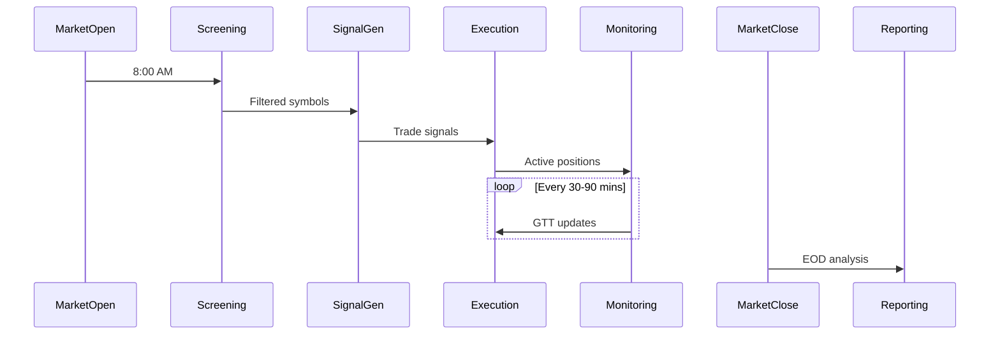
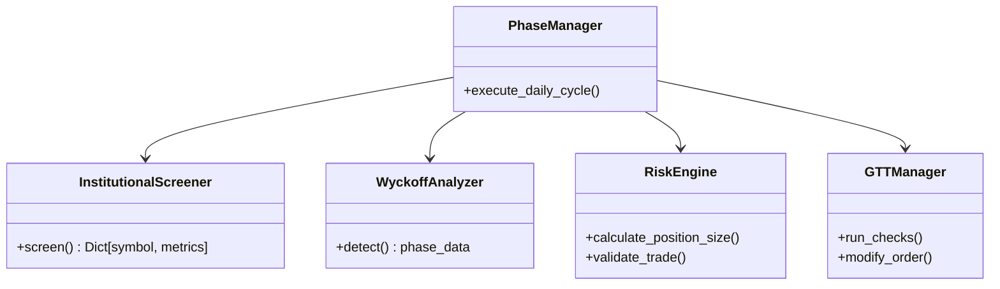
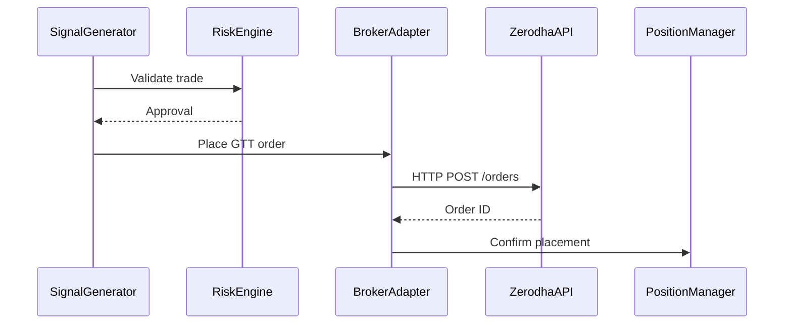

Here's comprehensive **High-Level Design (HLD)** and **Low-Level Design (LLD)** documentation for your Swing Trading System:

---

# **Swing Trading System - Technical Design**

## **1. High-Level Design (HLD)**

### **1.1 System Architecture**

  
_(Visual representation of components and data flow)_

**Key Components:**

1. **Data Ingestion Layer**

   - Market data feeds (NSE/BSE)
   - Institutional flow APIs
   - News aggregators

2. **Core Engine**

   - Phase-based workflow manager
   - Signal generation pipeline
   - Risk management subsystem

3. **Execution Layer**

   - Broker integrations (Zerodha/Upstox)
   - Order management system
   - GTT order processor

4. **Monitoring & Alerts**

   - Real-time position tracker
   - Alert dispatcher (Telegram/Email)

5. **Backtesting Framework**
   - Walkforward tester
   - Monte Carlo simulator

### **1.2 Workflow**



### **1.3 Key Technical Decisions**

| Decision Point  | Approach                 | Rationale                         |
| --------------- | ------------------------ | --------------------------------- |
| Data Pipeline   | Pandas + Custom Caching  | Balance flexibility & performance |
| Order Execution | Broker-specific adapters | Handle API differences            |
| Backtesting     | Vectorized operations    | Faster historical testing         |
| Alerting        | Telegram-first design    | Real-time mobile access           |

---

## **2. Low-Level Design (LLD)**

### **2.1 Core Class Diagram**



### **2.2 Key Modules Specification**

#### **2.2.1 Morning Screening**

```python
class InstitutionalScreener:
    """Filters stocks based on institutional activity"""

    def screen(self) -> Dict:
        """
        Output: {
            'RELIANCE': {
                'fii_net': 3.2e7,
                'dii_net': 1.8e7,
                'delivery_pct': 42
            }
        }
        """
```

#### **2.2.2 Signal Generation**

```python
class TrendClassifier:
    """Determines trend using 3-factor model"""

    def classify(self, data) -> Dict:
        """
        Returns: {
            'trend': 'uptrend',
            'score': 8.2,
            'support': 2450,
            'resistance': 2650
        }
        """
```

#### **2.2.3 Risk Management**

```python
class RiskAssessor:
    """Dynamic position risk evaluator"""

    def evaluate(self, symbol) -> Dict:
        """
        Returns: {
            'risk_score': 5,
            'action': 'hold|partial_exit|emergency_exit',
            'reason': 'technical_breakdown'
        }
        """
```

### **2.3 Database Schema**

```sql
CREATE TABLE trades (
    id SERIAL PRIMARY KEY,
    symbol VARCHAR(10),
    entry_price DECIMAL(10,2),
    exit_price DECIMAL(10,2),
    quantity INTEGER,
    pnl DECIMAL(10,2),
    strategy VARCHAR(20),
    entry_time TIMESTAMP,
    exit_time TIMESTAMP
);

CREATE TABLE gtt_orders (
    order_id VARCHAR(20) PRIMARY KEY,
    symbol VARCHAR(10),
    sl_price DECIMAL(10,2),
    target_price DECIMAL(10,2),
    status VARCHAR(10)
);
```

### **2.4 API Contracts**

**Broker Integration API:**

```typescript
interface GTTOrder {
  symbol: string;
  trigger: {
    lower: number; // SL price
    upper: number; // Target price
  };
  quantity: number;
  validity_days: number;
}

interface BrokerAdapter {
  placeGTT(order: GTTOrder): Promise<OrderResponse>;
  modifyGTT(orderId: string, updates: Partial<GTTOrder>): Promise<void>;
}
```

### **2.5 Sequence Diagrams**

**Trade Execution Flow:**



---

## **3. Error Handling**

### **3.1 Retry Mechanism**

```python
def place_order_with_retry(order, max_retries=3):
    for attempt in range(max_retries):
        try:
            return broker.place_order(order)
        except APIError as e:
            if attempt == max_retries - 1:
                raise
            time.sleep(2 ** attempt)
```

### **3.2 Circuit Breakers**

| Scenario                  | Action                       |
| ------------------------- | ---------------------------- |
| 5+ failed orders in 1 min | Pause trading for 5 mins     |
| Broker API down           | Fallback to secondary broker |
| Data feed latency > 2s    | Use cached data              |

---

## **4. Performance Considerations**

1. **Data Caching**:

   - 15-minute OHLC cache with Redis
   - Pre-market institutional data snapshot

2. **Parallel Processing**:

   ```python
   with ThreadPoolExecutor() as executor:
       results = executor.map(screener.analyze, symbols)
   ```

3. **Optimized Backtesting**:
   - Numpy vectorized operations
   - Pre-load 6 months data in memory

---

## **5. Deployment Architecture**

**Production Setup:**

- **Cloud**: GCP with Cloud Run
- **Scheduling**: Cloud Scheduler + Pub/Sub
- **Monitoring**: Cloud Logging + Prometheus
- **CI/CD**: Cloud Build with GitHub triggers

**Containerization:**

```dockerfile
# Multi-stage build
FROM python:3.9-slim as builder
COPY requirements.txt .
RUN pip install --user -r requirements.txt

FROM python:3.9-slim
COPY --from=builder /root/.local /root/.local
COPY . /app
CMD ["python", "main.py"]
```

---

## **6. Metrics & Monitoring**

**Key Dashboards:**

1. Trading Performance:

   - Win rate
   - Avg holding period
   - Sharpe ratio

2. System Health:
   - Order success rate
   - Data freshness
   - API latency

**Alert Thresholds:**

- > 3% failed orders/hour
- > 5s execution latency
- News sentiment score <-0.5

---

This documentation covers:

1. **HLD**: System-wide view, integrations, and data flow
2. **LLD**: Class-level specifications, algorithms, and error handling
3. **Operational**: Deployment and monitoring strategies

Would you like me to elaborate on any specific section or provide sample implementation for any component?
